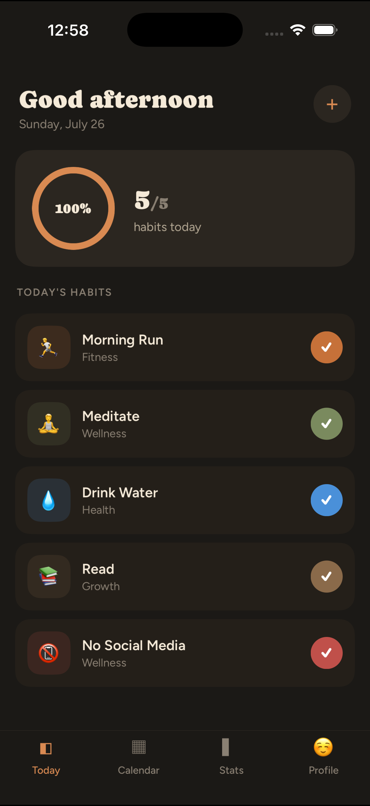
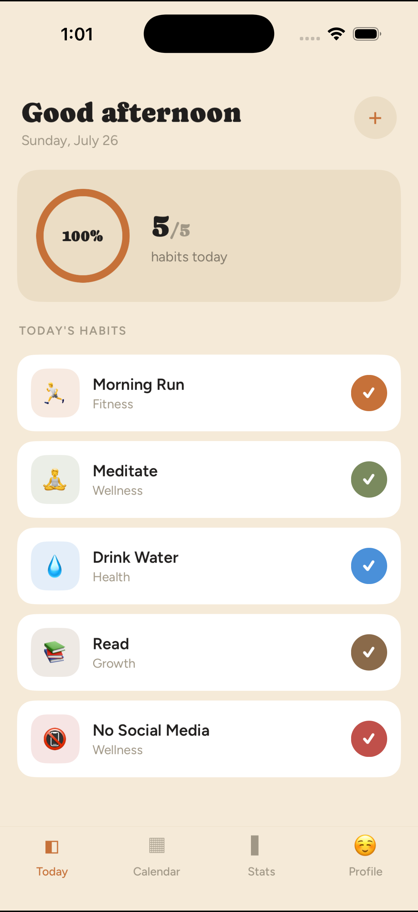

# Habit Tracker

An offline-first habit tracker for iOS and Android, built with Expo (React Native)
and a Supabase (Postgres) backend. Track daily habits, keep streaks, freeze a
streak when life happens, get local reminders, and see your progress on a
heatmap and stats screen — all working offline and syncing across devices.

Built end-to-end from an MVP design prototype: schema → migrations → typed
data layer → offline sync engine → mobile app.

## Screenshots

<p align="center">
  
  &nbsp;&nbsp;
  
</p>

<p align="center"><em>Today screen — dark and light themes</em></p>

## Features

- **Habits** — build or quit habits; binary / quantity / duration types; per-habit
  icon, color, category, and frequency (daily, weekdays, N×/week, weekly)
- **Today** — daily check-in with a completion ring and streak tracking
- **Streaks & freezes** — current/longest streaks; spend a streak freeze to
  protect a streak (atomic on the server)
- **Calendar** — GitHub-style completion heatmap
- **Stats** — overall completion %, per-habit rates, milestones
- **Reminders** — per-habit local notifications with a custom time and day picker
- **Appearance** — system / light / dark theme, synced to your profile
- **Offline-first** — the app reads/writes a local SQLite mirror instantly and
  syncs to Supabase in the background (last-write-wins, tombstone deletes)

## Tech stack

- **App:** Expo SDK 51, Expo Router, React Native, TypeScript
- **Backend:** Supabase — Postgres, Row-Level Security, Auth, RPC functions
- **Local store:** SQLite (`expo-sqlite`) mirror with a custom sync engine
- **Notifications:** `expo-notifications` (local)

## Project structure

```
app/                 Expo Router screens (Today, Calendar, Stats, Profile, editors)
components/           Shared UI (e.g. progress Ring)
lib/                  App glue: Supabase client, offline/auth provider, theme, notifications
src/
  data/              Typed cloud data-access layer (Supabase)
  local/             Offline SQLite mirror + repositories (mirror the cloud API)
  sync/              The sync engine (push/pull, last-write-wins) + tests
supabase/
  migrations/        Schema, RLS, auth trigger, stats RPCs, hardening
  seed.sql           Demo user + sample habits/logs
  types/             Generated TypeScript types for the schema
"Habit Tracker MVP Design/"   The original design prototype (dc.html)
```

See also: [`ROADMAP.md`](ROADMAP.md) (path to production),
[`BACKEND_SCHEMA.md`](BACKEND_SCHEMA.md) (data model rationale),
[`MOBILE.md`](MOBILE.md) (app details), [`supabase/migrations/README.md`](supabase/migrations/README.md),
and [`src/sync/README.md`](src/sync/README.md) (sync architecture).

## Getting started

### 1. Backend (Supabase)

Apply the migrations and seed to a Supabase project:

```bash
supabase link --project-ref <your-project-ref>
supabase db push          # applies supabase/migrations/*
# seed: run supabase/seed.sql against the project (local dev: `supabase db reset`)
```

### 2. App

```bash
npm install
cp .env.example .env       # add your Supabase URL + anon (publishable) key
npx expo start             # press i (iOS) / a (Android), or scan with Expo Go
```

Demo login (if you loaded the seed): `demo@habittracker.app` / `password123`.

## Development

```bash
npm run typecheck          # typecheck the shared backend/library code
npm test                   # run the sync-engine tests (node:test + node:sqlite)
npm run typecheck:app      # typecheck the Expo app (after npm install)
```

## Architecture highlights

- **Offline-first:** every screen reads/writes local SQLite; the sync engine
  reconciles with Supabase (push-then-pull, `updated_at` last-write-wins, soft
  deletes that propagate). It's resilient by design — per-table isolation and a
  per-operation timeout so one bad/hung request can't wedge the engine.
- **Derived stats:** streaks, completion rates, and the heatmap are computed
  from the completion log (Postgres RPCs + a matching TS implementation for
  offline), never stored — so sync can't corrupt them.
- **Security:** Row-Level Security on every table (users only see their own
  rows); functions have pinned `search_path`.

## License

[MIT](LICENSE) © 2026 Av1yan
